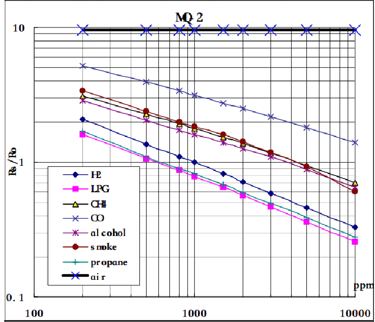
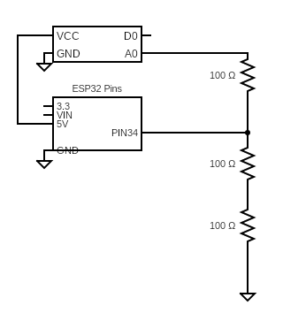
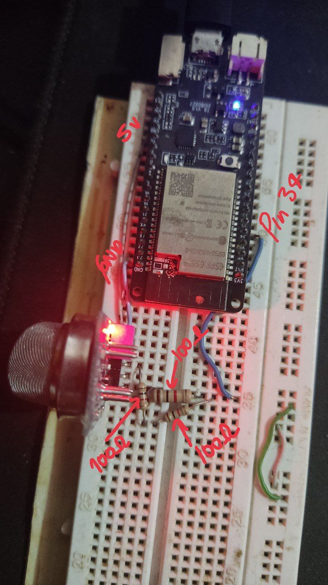

# ESP32 GAS MONITORING

## About

This code allows to monitor gas emissions thanks to the MQ2 sensor. The gases that are measured with this sensor are:
- CO
- LPG
- CH4
- Propane
- Smoke

This is done by means of the interpolation that is done thanks to the graph given by the manufacturer.



In [MQ2_data](./MQ2_data.py) can see this process.

## Scheme





If you use another PIN modify this in main.py the variable called `mq2pinSignal`

## Settings

Para que este funcione, se debe modificar el archivo [settings.json](./settings.json) con los valores para que funcione correctamente, estos valores son:

```json
{
    "ssid": "",
    "password_wlan": "",
    "mqtt_user": "",
    "mqtt_password": "",
    "mqtt_server": "",
    "mqtt_port": 1883,
    "mqtt_topic": ""
}
```

- `ssid` : Name of the network to which the ESP32 will connect.
- `password_wlan` : Network password.
- `mqtt_user` : User to connect to the MQTT server.
- `mqtt_password` : Password to connect to the MQTT server.
- `mqtt_server` : Hostname of the server on which we have the MQTT service.
- `mqtt_port` : Port on which the MQTT server listens.
- `mqtt_topic` : Topic to which we will publish the data.
